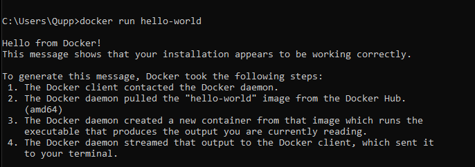
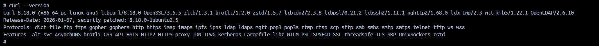
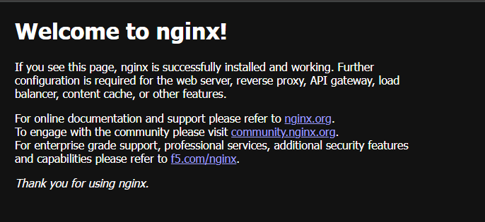
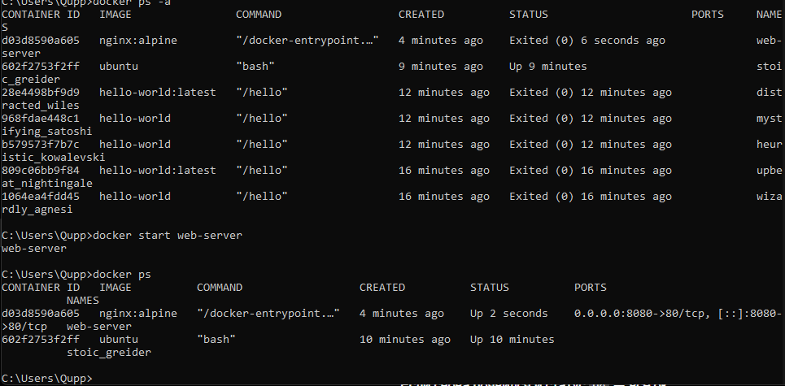
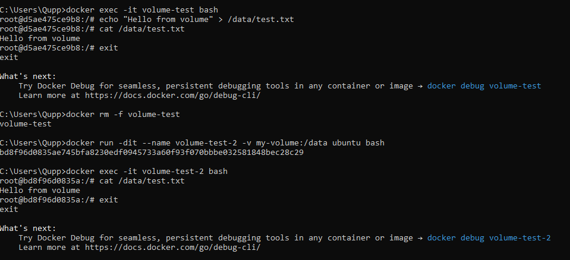
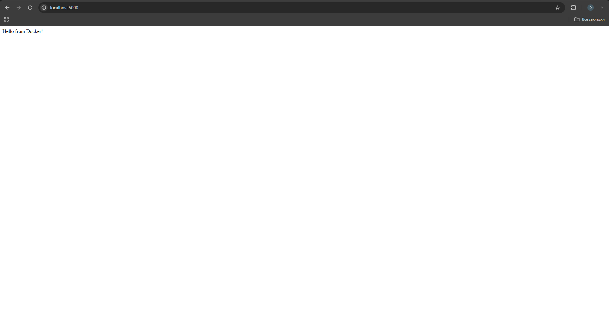
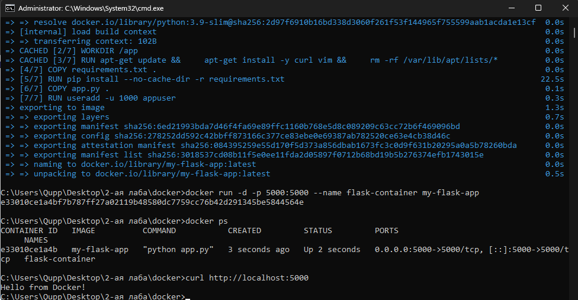

University: [ITMO University](https://itmo.ru/ru/)
Faculty: [FICT](https://fict.itmo.ru)
Course: [Введение в веб технологии](https://itmo-ict-faculty.github.io/introduction-in-web-tech/)
Year: 2025/2026
Group: U4125
Author: Вернов Дмитрий Андреевич
Lab: Lab1
Date of create: 19.09.2026
Date of finished: 

# Лабораторная работа №1. Основы Docker

## Цель работы

Познакомиться с основными возможностями Docker: запуском контейнеров, использованием готовых образов, управлением контейнерами, работой с volumes и созданием собственного Docker-образа с помощью Dockerfile.

## 1. Установка и проверка Docker

Для выполнения лабораторной работы был установлен Docker Desktop.

Версия Docker была проверена командой:

```bash
docker --version
```

Для проверки корректности установки был запущен тестовый контейнер:

```bash
docker run hello-world
```

В результате выполнения команды было получено сообщение:

```text
Hello from Docker!
```

Также были изучены основные команды Docker:

```bash
docker images
docker ps
docker ps -a
```

Команда `docker images` отображает локально сохранённые Docker-образы.

Команда `docker ps` показывает запущенные контейнеры.

Команда `docker ps -a` отображает все контейнеры, включая остановленные.

### Результат

Docker был успешно установлен и настроен.



## 2. Работа с образом Ubuntu

Был загружен официальный образ Ubuntu:

```bash
docker pull ubuntu:latest
```

После этого был запущен интерактивный контейнер:

```bash
docker run -it ubuntu bash
```

Внутри контейнера был обновлён список пакетов:

```bash
apt update
```

После этого был установлен пакет `curl`:

```bash
apt install -y curl
```

Установка была проверена командой:

```bash
curl --version
```

Для выхода из контейнера использовалась команда:

```bash
exit
```

### Результат

Был успешно запущен контейнер Ubuntu и установлен дополнительный пакет внутри него.



## 3. Запуск веб-сервера nginx

Для запуска веб-сервера использовался образ `nginx:alpine`.

Контейнер был запущен командой:

```bash
docker run -d -p 8080:80 --name web-server nginx:alpine
```

Параметр `-d` запускает контейнер в фоновом режиме.

Параметр `-p 8080:80` связывает порт `8080` основной системы с портом `80` внутри контейнера.

После запуска была выполнена команда:

```bash
docker ps
```

Работа веб-сервера была проверена в браузере по адресу:

```text
http://localhost:8080
```

В браузере отобразилась стандартная страница nginx:

```text
Welcome to nginx!
```

Для просмотра логов контейнера использовалась команда:

```bash
docker logs web-server
```

Для подключения к контейнеру использовалась команда:

```bash
docker exec -it web-server sh
```

### Результат

Веб-сервер nginx был успешно запущен внутри Docker-контейнера и стал доступен через порт `8080`.



## 4. Управление контейнерами

Для просмотра работающих контейнеров использовалась команда:

```bash
docker ps
```

Для просмотра всех контейнеров:

```bash
docker ps -a
```

Контейнер `web-server` был остановлен:

```bash
docker stop web-server
```

После остановки он был снова запущен:

```bash
docker start web-server
```

После проверки контейнер был остановлен и удалён:

```bash
docker stop web-server
docker rm web-server
```

Также был удалён использовавшийся образ:

```bash
docker rmi nginx:alpine
```

### Результат

Были изучены основные команды для управления жизненным циклом Docker-контейнеров и образов.



## 5. Работа с Docker Volumes

Для проверки постоянного хранения данных был создан Docker Volume:

```bash
docker volume create my-volume
```

Список volumes был проверен командой:

```bash
docker volume ls
```

После этого был создан контейнер с подключённым volume:

```bash
docker run -dit --name volume-test -v my-volume:/data ubuntu bash
```

Для подключения к контейнеру использовалась команда:

```bash
docker exec -it volume-test bash
```

Внутри контейнера был создан файл:

```bash
echo "Hello from volume" > /data/test.txt
```

Его содержимое было проверено:

```bash
cat /data/test.txt
```

Результат:

```text
Hello from volume
```

После этого контейнер был удалён:

```bash
docker rm -f volume-test
```

Был создан новый контейнер, использующий тот же volume:

```bash
docker run -dit --name volume-test-2 -v my-volume:/data ubuntu bash
```

После подключения к новому контейнеру:

```bash
docker exec -it volume-test-2 bash
```

было проверено содержимое файла:

```bash
cat /data/test.txt
```

Файл сохранился даже после удаления первоначального контейнера.

### Результат

Было продемонстрировано, что Docker Volume позволяет хранить данные независимо от жизненного цикла контейнера.



# Дополнительное задание

## 6. Создание собственного Dockerfile

Для дополнительного задания было создано простое веб-приложение на Flask.

Структура проекта:

```text
docker/
├── app.py
├── requirements.txt
└── Dockerfile
```

### Файл app.py

```python
from flask import Flask

app = Flask(__name__)

@app.route('/')
def hello():
    return "Hello from Docker!"

if __name__ == '__main__':
    app.run(host='0.0.0.0', port=5000)
```

### Файл requirements.txt

```text
Flask==2.0.1
Werkzeug==2.0.3
```

Версия `Werkzeug` была зафиксирована на `2.0.3`, поскольку Flask 2.0.1 несовместим с современными версиями Werkzeug, в которых отсутствует используемая Flask функция `url_quote`.

### Dockerfile

```dockerfile
FROM python:3.9-slim

WORKDIR /app

RUN apt-get update && \
    apt-get install -y curl vim && \
    rm -rf /var/lib/apt/lists/*

COPY requirements.txt .

RUN pip install --no-cache-dir -r requirements.txt

COPY app.py .

RUN useradd -u 1000 appuser

USER appuser

EXPOSE 5000

ENV FLASK_ENV=production

CMD ["python", "app.py"]
```

В Dockerfile:

- используется базовый образ `python:3.9-slim`;
- рабочая директория устанавливается в `/app`;
- устанавливаются системные пакеты `curl` и `vim`;
- устанавливаются Python-зависимости из `requirements.txt`;
- копируется файл `app.py`;
- создаётся пользователь `appuser` с UID 1000;
- выполняется переключение на пользователя `appuser`;
- открывается порт `5000`;
- задаётся переменная окружения `FLASK_ENV=production`;
- приложение запускается командой `python app.py`.

## 7. Сборка и запуск собственного Docker-образа

Образ был собран командой:

```bash
docker build -t my-flask-app .
```

После успешной сборки был создан и запущен контейнер:

```bash
docker run -d -p 5000:5000 --name flask-container my-flask-app
```

Работа контейнера была проверена:

```bash
docker ps
```

Веб-приложение было проверено командой:

```bash
curl http://localhost:5000
```

Результат:

```text
Hello from Docker!
```

Также приложение доступно в браузере по адресу:

```text
http://localhost:5000
```


### Результат

Был создан собственный Docker-образ с Flask-приложением и запущен контейнер на его основе.



## Вывод

В ходе лабораторной работы были изучены основные возможности Docker.

Была выполнена работа с готовыми образами Ubuntu и nginx, изучены команды управления контейнерами и образами, настроено постоянное хранение данных с помощью Docker Volumes.

В дополнительной части работы был создан собственный Dockerfile для Flask-приложения, собран Docker-образ и запущен контейнер с веб-приложением.
